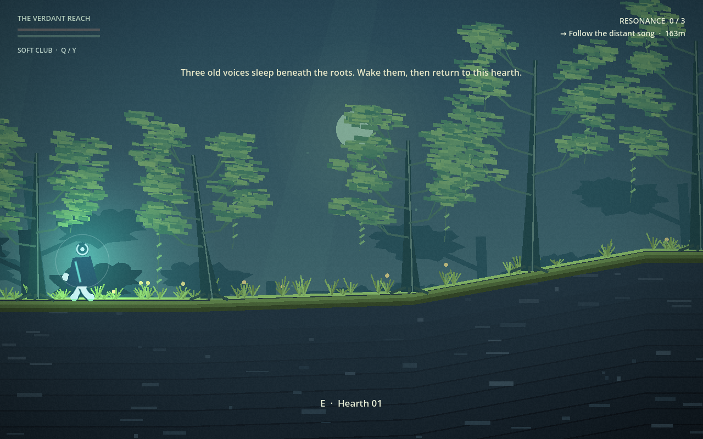

# Elastic Explorer · v0.1

A small exploration experiment about a creature that can make almost any limb a hand, a foot, or a weapon.

Stretch toward a ledge. Stick to a wall. Fold into a narrow passage, roll downhill, or swim beneath luminous roots. Follow the distant song through a persistent procedural wilderness, wake three alien resonators, and find your way back to the first hearth.



**Godot 4.7.1 · Web + Windows + Steam Deck · Single player**

### [Play in your browser](https://halr9000.github.io/elastic-explorer/)

Use a desktop browser with WebGL 2 support. Click the game to focus controls and enable audio.

## The experiment

Your headless creature moves with procedurally animated, sticky limbs. Its shape changes with the task: upright for walking, compressed for tunnels, curled for speed, and stretched for climbing. Combat turns an available limb into a swollen tendril club, with heavy and thorned variations to discover.

The world combines surface wilderness, caves, underwater passages, ruins, and alien artifacts. Layered scenery, luminous flora, dynamic lighting, wildlife, and procedural audio give the journey its atmosphere. A shared endurance pool makes the next dry foothold or patch of open water matter.

**v0.1 closes this experiment as a playable prototype.** Windows and native Steam Deck builds are available locally, and the Deck build has been tried and accepted for this milestone. There is no crafting, construction, multiplayer, terrain destruction, or fluid simulation.

## Play

**Windows:** run `builds/ElasticExplorer.exe`, or run `Launch.ps1`. The executable embeds its game data and can run on its own.

**Steam Deck:** launch **ElasticExplorer** from the Steam library after deployment. It runs natively on Linux at 1280×800 with gamepad controls.

**From source:** open `project.godot` in Godot 4.7.1 and run the main scene. Exported binaries live in the ignored `builds/` directory; they are not included in Git.

Start with **Movement clearing** to practice jumping, rolling, swimming, squeezing, and climbing. **Begin a new world** starts a persistent seeded expedition. Continue restores an existing expedition; starting again archives its files first.

| Action | Keyboard / mouse | Controller |
| --- | --- | --- |
| Move / swim | WASD | Left stick |
| Aim | Mouse | Right stick |
| Jump / swim burst | Space | A |
| Grip / climb | Hold right mouse, aim at surface | Hold LT, aim at surface |
| Tendril attack | Left mouse | RT |
| Roll | Hold Shift | Hold RB |
| Squeeze | Hold Ctrl | Hold LB |
| Interact / checkpoint | E | X |
| Cycle acquired weapons | Mouse wheel up / down | Y |
| Pause | Esc | Menu |
| Menu navigation | Arrow keys / Enter / mouse | D-pad / A |

Climbing and swimming share endurance. Rest on safe ground or float at the water surface to recover. Exhaustion releases grips or causes sinking; staying submerged without endurance damages health. A deep underwater floor does not count as rest. Checkpoints restore both meters.

Find the heavy tip and thorn lash along the route. Wake the Canopy Bell, Drowned Choir, and Root Memory. The HUD points toward the next sleeping resonator, then back to the starting hearth. Completion leaves the world open for exploration.

## Saves

| Platform | Save directory |
| --- | --- |
| Windows | `%APPDATA%/ElasticExplorer/` |
| Steam Deck | `~/.local/share/ElasticExplorer/` |
| Web | Browser storage for this site (separate from desktop saves) |

Keep site data enabled for browser saves. Clearing site data removes them; private browsing may not retain them between sessions.

The primary file is `expedition.json`; `.bak` holds the previous valid state. Terrain geometry is recorded, so Continue does not regenerate a different world. Pickups, defeated enemies, discoveries, weapon state, checkpoint, and completion persist.

New World archives the previous expedition. Damaged originals are preserved when recovering a backup. Settings are separate in `settings.cfg`. Automated tests use separate test filenames and do not touch a real expedition.

## Verify and build

```powershell
./tools/test.ps1
./tools/build.ps1
./tools/build.ps1 -Target Web
```

The Windows tooling requires PowerShell, Git, Python 3, and Godot 4.7.1 with matching export templates. The scripts locate the installed Godot console executable. Pass `-Godot 'C:/path/to/godot_console.exe'` to override.

Tests run at real physics cadence; allow roughly 90 seconds. They check real player physics, 100 generated seeds, combat, persistence, and the expedition loop. Both exit codes and engine error output are checked. Building runs these tests by default.

Build output includes a SHA-256 manifest. Matching Godot 4.7.1 export templates must be installed. `-SkipTests` on the build script is intended only after the same revision has passed verification.

## Web publishing

The [Pages workflow](.github/workflows/pages.yml) builds and tests the game with Godot
4.7.1, then publishes it on every push to `implementation/elastic-explorer`.
The Web preset uses a single thread, so GitHub Pages needs no custom isolation headers.
To try a local export, serve `builds/web/` over HTTP rather than opening `index.html` directly:

```powershell
python -m http.server 8000 --directory builds/web
```

Open `http://localhost:8000`. Browser saves belong to that origin and do not transfer
to the published site. Use Escape to pause and save back to the title before closing.

## Steam Deck

Build the native Linux x86-64 release and deploy through an already paired SteamOS devkit:

```powershell
./tools/build.ps1 -Target SteamDeck
python tools/deploy_deck.py --dry-run
python tools/deploy_deck.py
```

Deployment defaults to the paired Deck at `192.168.2.177`; override with `--host`.
Use `--devkit` to override the installed SteamOSDevkitClient `windows-client` directory.
The script verifies source and artifact hashes, uploads the separate `ElasticExplorer` title,
registers a native Linux Gaming Mode shortcut at 1280×800, and verifies a fresh process.
It preserves saves and other titles. The process guard is adapted from the simsim devkit workflow.
The default gamepad bindings above apply to Deck controls; no keyboard entry is required.
`--capture` runs a temporary sandbox smoke capture; deploy again without that flag to restore normal launch.

## v0.1 verification

- Five automated suites passed, including validation of 100 generated seeds.
- The native Deck executable was hash-verified after upload and launched through Steam.
- A 1280×800 on-device opening-scene sample reported 60 fps, with a 16.71 ms median and 17.05 ms p95 frame time over 180 frames.
- The owner reported that everything works well enough for the experiment.

The short performance sample is not a sustained benchmark. Full-expedition pacing, battery life, and suspend/resume have not been systematically measured. The original 15–20-minute expedition length remains a design target.

See [first expedition verification](docs/testing/first-expedition.md) and [Deck verification](docs/testing/steam-deck.md) for the recorded checks.

## Project layout

| Directory | Contents |
| --- | --- |
| `game/` | Player, combat, wildlife, world generation, presentation, saves, and UI |
| `tests/` | Automated gameplay and persistence checks |
| `tools/` | Test, export, and Steam Deck deployment scripts |
| `docs/` | Design notes, implementation history, and verification evidence |
